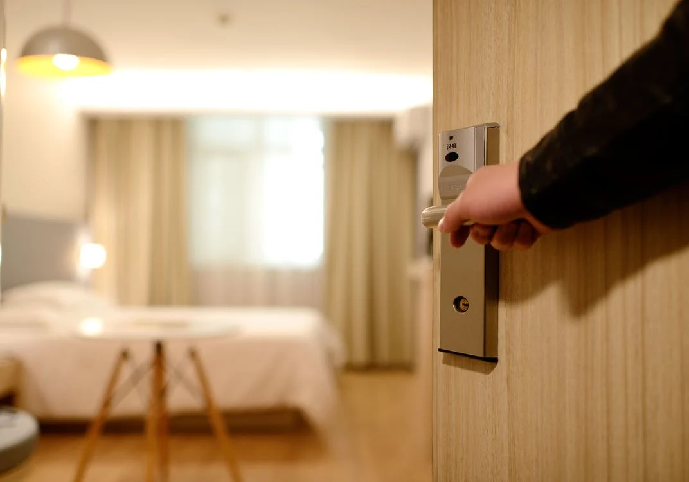

# Interface do utilizador

Quando o utilizador entra no nosso site e a primera coisa que vai reparar será no nome da nossa empresa e nos tabs de "Como funciona" , "Sobre", "Contacto" e "API"

O resto da página apela ao utilizador a inscrever-se na nossa plataforma e podir vir a subscrever algum dos nossos serviços.

# Sketchs

| | |
:---: | :---:
 | Turismo inteligente 

 |  Esqueça os cartões e as chaves, nós tratamos disso. Fechaduras
 inteligentes para negócios inteligentes.

| | |
:---: | :---:
 | Tudo o que precisa

 |Com as nossas soluções, os seus hóspedes e colaboradores não precisam de se preocupar com assuntos desnecessários. Deixe a parte difícil connosco.

 | | |
:---: | :---:
 | Onde e quando?

 |Informações ao segundo sobre o número de áreas em utilização, histórico de entradas e saídas, estatísticas, e uma sensação de segurança e paz verdadeira.
 
---
[< Previous](c1.md) | [^ Main](../../../) | [Next >](c3.md)
:--- | :---: | ---: 