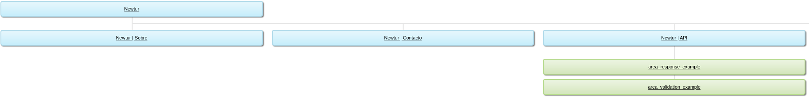

# C3: Product
We chose to start the development of our interface using the "Mobile First" concept.
The focus of our pages is only to present relevant and essential information.

# Instalation

**Local**:
1. Clone the repository: ```git clone https://github.com/inf-21-ti-g6/trabalho_pratico.git```

2. Open the src/index.html file in your browser.

**Netlify.com**:
1. Create an account
2. Import an existing project
3. Link account to github
4. Authorize Netlify
5. Select repository
6. Populate the "base directory" option with "src"
7. Deploy

# Navigation
The user can navigate through the website using the navigation bar at the top of every page.

# Forms
On the contact us page the user can fill out a form that accepts the following values:
- name
- email
- message

Each of the values is validated using javascript when the form is submitted. You can check the verification code present in the file [form.js](../src/js/form.js).

# HTML5 and CSS3 validation
As requested by the teacher, the validation of the files using the W3C validator is as follows:


# Implementation details
All the minimum requirements stated by the teacher have been met and can be identified from the .html and .css files in the [src folder](../src).
As enhancement elements it is possible to verify the [form.js file](../src/js/form.js) where javascript was used to validate the form data of the contact us page.

# Sitemap


---
**Navigation** 
[< Previous](c2.md) | [Main](../../../) | [Next >](c4.md)
:--- | :---: | ---: 
